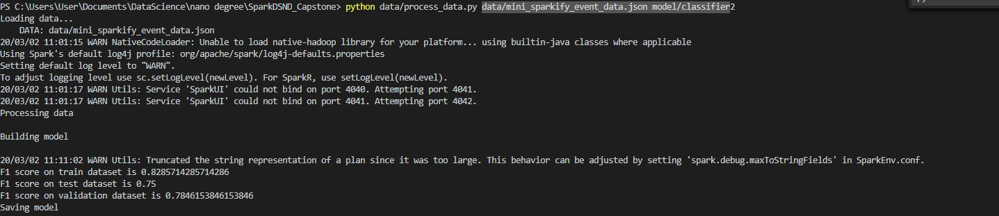
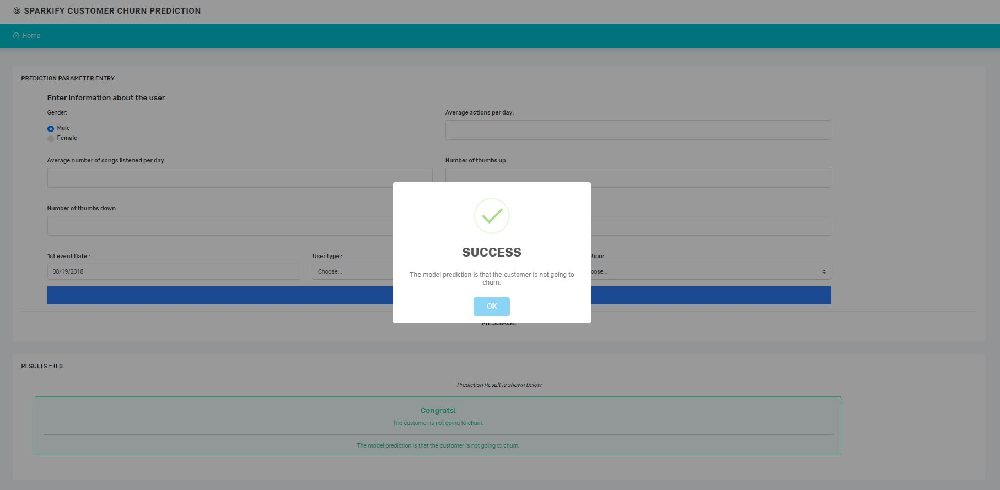
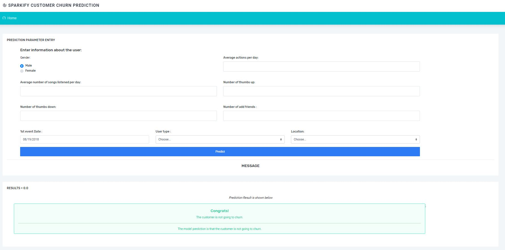

# Data Scientist Nanodegree

## Project: Udacity DSND Capstone Data Analysis using Spark

## Table of Contents

- [Project Overview](#overview)
   - [Problem Statement](#Problem-Statement)
   - [Metrics](#Metrics)
- [Project Components](#components)
  - [Input Data](#input-data)
  - [Implementation](#Implementation)
    - [ETL Pipeline](#ml_pipeline)
    - [ML Pipeline](#ml_pipeline)
  -[Flask Web App](#flask)
- [Running](#run)
  - [Data Cleaning](#cleaning)
  - [Starting the Web App](#starting)
- [Files](#files)
- [Conclusion](#conclusion)
- [Software Requirements](#sw)
- [Credits and Acknowledgements](#credits)

***

<a id='overview'></a>

## 1. Project Overview
Predicting churn rates is quite a challenging and common problem regularly encountered in any customer-facing business. It is crucial for businesses to identify customers who are about to churn and take action to retain them before it happens. Being proactive on this can significantly increase customer satisfaction for sevices rendered by the business.
The goal of this project was to help Sparkify music service retain their customers. In this project, data analysis was done using a minified version of the large dataset due to availability of resources needed to run the large dataset. Also, an analysis of different machine learning techniques were explored in order to determine the best machine learning algorithm to use for prediction. Further more, a web application was developed to demonstrate the results.


[Here](#eg) are a few screenshots of the web app.

**_Screenshot 1_**
MASTER SCREEN


<a id='Problem-Statement'></a>

### Problem Statement
The goal of the project is to help to sparkify take proactive measure in retaining their customers, the main task of the project is to make a prediction, whether the customer is about to churn. Such a prediction can be made for each customer by a binary classifier model. The following tasks should be completed to create the model:

*	Analyze and preprocess the data to extract features for each customer;
*	Train classifier to predict customer churn;
*	Evaluate the classifier concerning the chosen metric;
*	Build a web application to demonstrate the results.

<a id='Metrics'></a>

### Metrics

The initial dataset analysis shows that there are more than 3 times fewer users, who churned, than other users. This is the reason why we can’t use accuracy (the number of correct predictions divided by the total number of predictions) as a metric to evaluate the resulting model. 
Therefore, in this case, we care more about both types of errors: false negatives and false positives because, in false negative we can miss the customer who is going to churn and lose the customer and in case of false positive we can have unnecessary costs on retaining the customer who was not going to churn. That is why as a metric to evaluate the model using F1 score because it equally considers both the precision and the recall.


<a id='components'></a>

## 2. Project Components

There are three(3) components of this project:

<a id='Input-Data'></a>

### Input Data
As input data, a mini dataset is used for analysis:
* mini_sparkify_event_data.json – a tiny subset of the full dataset, which is useful for preliminary data analysis.
 this can be downloaded from __[Sample data file](https://www.kaggle.com/ibrodex/Sparkify)__  and place in _data_ folder.
* The __explorative data analysis (EDA)__ of the mini dataset (the subset of the whole dataset) is provided in [Sparkify.ipynb](https://github.com/ebrym/SparkifyCapstoneProject/blob/master/Sparkify.ipynb).


<a id='Implementation'></a>

### Implementation

The original dataset contain massive amounts of data, which can’t be processed on a single machine. Spark clusters will be used to analyze data and predict customer churn using PySpark and SparkML libraries to implement the solution.
The implementation of the project consists of two parts:
* Application of machine learning methods to predict churn. This part involves creation of machine learning pipelines, evaluation and tuning of the approach.
* Development of a web application to demonstrate the resulting model.

<a id='ml_pipeline'></a>

### 2.1. ETL Pipeline

File _data/process_data.py_ contains data cleaning operations that:

- Loads the dataset from the JSON file.
- Cleans the data
- Extract the feature needed for Machine Learning Prediction.
- Build and save Machine learning model.

**_Screenshot ETL/ML_**


<a id='ml_pipeline'></a>

### 2.2. Machine Learning

Machine learning pipeline for our task consists of the following steps:
1.	Split dataset into train, test, and validation.
2.	Create dummy columns out of categorical columns e.g. ‘gender’, ‘last_level’, and ‘last_state’. When using pyspark machine learning library sparkml, this step actually consists of two parts: indexing categorical column and encoding it.
3.	Create a feature vector.
4.	Train the classifier.
The Random Forest Classifier was chosen from the set of other models (Logistic Regression, Gradient-boosted Tree, Naive Bayes) because it demonstrated the best performance in terms of the F1 score (82%).


<a id='flask'></a>

### 2.3. Flask Web App

The web application is implemented with:
* Flask running the back-end,
* Bootstrap controls of front-end.
The web application consists of the following parts:
* Python script [process_data.py](https://github.com/ebrym/SparkifyCapstoneProject/blob/master/model/process_data.py) which builds the machine learning model. This script accepts the path to the dataset and the path where the resulting model should be saved as parameters.
* The machine learning model, which is created by script create_model.py. The application loads the model and uses it to make predictions.
* Python script [run.py](https://github.com/ebrym/SparkifyCapstoneProject/blob/master/app/run.py), which runs the logic of the application and renders web pages. The script loads the model on start and applies it to make predictions out of the data provided by the user on the web page.
* Web page templates [master.html](https://github.com/ebrym/SparkifyCapstoneProject/blob/master/app/templates/master.html) and [go.html](https://github.com/ebrym/SparkifyCapstoneProject/blob/master/app/templates/go.html) of application web pages. Pages use bootstrap controls.
The web application allows the user to enter the information about the customer and then tells whether the customer is about to churn based on this information.


<a id='run'></a>

## 3. Running

There are two(2) steps to get the appplication up and runnning with the web app.

<a id='cleaning'></a>

### 3.1. Data Cleaning and ML Model Building

**Go to the project directory** and then run the following command:

```bat
python data/process_data.py data/mini_sparkify_event_data.json model/classifier
```

This will perform cleaning operations on the data and build a machine learning model that is saved to 'model' folder.


<a id='starting'></a>

### 3.2. Starting the web app

After performing the above processes, you can now run the web app to see the visualizations.

**Go the app directory** and run the following command:

<a id='com'></a>

```bat
python run.py
```

This will start the web app and will direct you to a URL where you can enter messages and get classification results for it.
**NOTE:** Running on Windows requires you to use http://localhost:3001

<a id='eg'></a>

**_Screenshot 3_**






<a id='files'></a>

## 4. Files
The repository has the following structure:
```
- app
| - templates
| |- master.html  # main page of web app
| |- go.html  # classification result page of web app
| - static # contains static files like css and javascript.
|- run.py  # Flask script that runs app

- data
|- mini_sparkify_event_data.json # can be downloaded from [Sample data file](https://www.kaggle.com/ibrodex/Sparkify)__ and place in _data_ folder.
|- process_data.py # script, which builds the classifier to predict customer churn

- screenshots
|- home.jpg # the screenshot of the main page
|- result.png # the screenshot of page with prediction result
|- success_result_1.JPG # pictoril representation of the  succesful prediction with pop up message.
|- success_result.JPG # pictoril representation of the  succesful prediction.

- README.md
- Sparkify.ipynb # Python 3 notebook, which contains EDA of small dataset
```


<a id='conclusion'></a>

## 5. Conclusion

The goal of the project is to help the Sparkify service to retain their customers. The proposed solution to reach this goal is as follows:
* A large part of the solution is the preprocessing of the initial data. Transforming the data into records in terms of each Sparkify customer. Feature engineering and preprocessing were required in order to prepare the data ready for machine learning.
* The second large part of the solution is the machine learning pipeline, which predicts customer churn. I tried several classifiers and compared their F1 scores to choose the best performing solution. I also tuned the classifiers with the help of a grid search and cross-validation for the chosen classifier.
* The last part of the solution is the web application which demonstrates the churn prediction. The web application allows the user to enter the information about the customer and then identifies whether this customer is about to churn. 
* All parts of the solution are built in Python using Spark.
 
The most challenging parts of this project is feature engineering and the refinement of the model. In feature engineering it is quite challenging to determine which features to use for prediction and on one hand will help to predict churn and will not overfit the model on the other. Also, i had difficulties setting up spark enviroment on my local machine in order to build and train the ML model as well as running the web app.

### Improvement
In order to improve on the proposed solution, the following might be considered:
* Use larger dataset for machine learning. Having more data could raise the robustness of the model.
* Try model stacking to raise the accuracy of the prediction.
* Try more algorithms (Train time was an issue).
* Increase number of parameters in cross validation.


<a id='sw'></a>

## 6. Software Requirements

This project uses **Python 3.7**

## External Libraries
1. [PySpark](https://spark.apache.org/docs/2.2.1/api/python/index.html#), SparkML
2. [Flask](http://flask.pocoo.org/docs/1.0/installation/)
3. [findspark](https://github.com/minrk/findspark)

<a id='credits'></a>

## 7. Credits and Acknowledgements

Thanks <a href="https://www.udacity.com" target="_blank">Udacity</a> team.
Template for web app is gotten from <a href="https://coderthemes.com" target="_blank">Coder Themes</a>.

