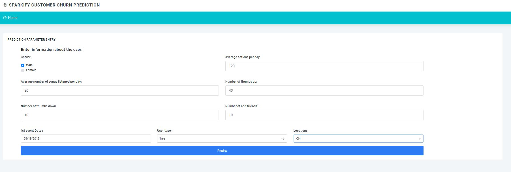
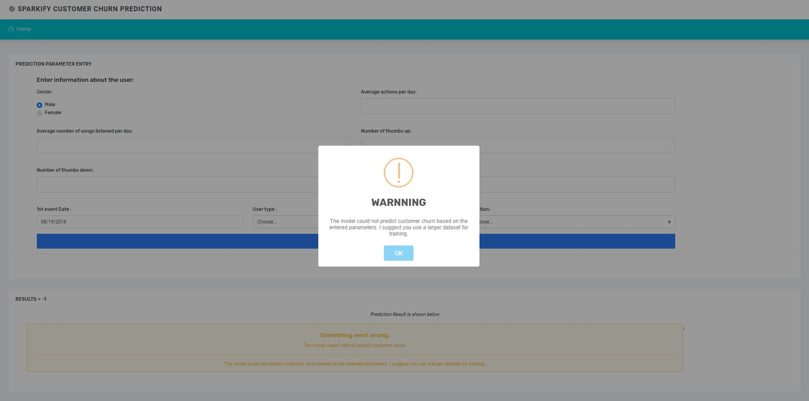

# Data Scientist Nanodegree

## Project: Udacity DSND Capstone Data Analysis using Spark

## Table of Contents

- [Project Overview](#overview)
   - [Problem Statement](#Problem-Statement)
   - [Metrics](#input-data)
- [Project Components](#components)
  - [Input Data](#input-data)
  - [Implementation](#input-data)
    - [ETL Pipeline](#ml_pipeline)
    - [ML Pipeline](#ml_pipeline)
    - [Flask Web App](#flask)
- [Running](#run)
  - [Data Cleaning](#cleaning)
  - [Training Classifier](#training)
  - [Starting the Web App](#starting)
- [Conclusion](#conclusion)
- [Files](#files)
- [Software Requirements](#sw)
- [Credits and Acknowledgements](#credits)

***

<a id='overview'></a>

## 1. Project Overview
Predicting churn rates is a challenging and common problem that data scientists and analysts regularly encounter in any customer-facing business. It is crucial for businesses to identify customers who are about to churn and take action to retain them before it happens.
The goal of this project was to help Sparkify music service retain their customers. In this project, data analysis was done using a minified version of the large dataset dues to availability of resource need to run the large dataset. Also, an analysis of different machine learning techniques were explored in order to determine the best machine learning algorithm to use for prediction. Further more, a web application was developed to demonstrate the results.


[Here](#eg) are a few screenshots of the web app.

**_Screenshot 1_**
MASTER SCREEN


**_Screenshot 2_**
CLASSIFICATION SCREEN


<a id='Problem-Statement'></a>
### Problem Statement
As the goal of the project is to help to retain the customers, the main task of the project is to make a prediction, whether the customer is about to churn. Such a prediction can be made for each customer by a binary classifier model. The following tasks should be completed to create the model:
•	Analyze and preprocess the data to extract features for each customer;
•	Train classifier to predict customer churn;
•	Evaluate the classifier concerning the chosen metric;
•	Build a web application to demonstrate the results.

<a id='Metrics'></a>

### Metrics

The initial dataset analysis shows us that the dataset is imbalanced: there are more than 3 times fewer users, who churned, than other users. That is why I can’t use accuracy (which is the number of correct predictions divided by the total number of predictions) as a metric to evaluate the resulting model. 
In our case, we should care about both types of errors: false negatives and false positives because in case of false negative we can miss the customer who is going to churn and lose the customer and in case of false positive we can have unnecessary costs on retaining the customer who was not going to churn. That is why as a metric to evaluate the model I chose F1 score because it equally considers both the precision and the recall.


<a id='components'></a>

## 2. Project Components

There are three components of this project:

<a id='Input-Data'></a>

### Input Data
As input data I have several datasets, which contain the log of Sparkify music service events:
* mini_sparkify_event_data.json – a tiny subset of the full dataset, which is useful for preliminary data analysis.
 this can be downloaded from 


__[Sample data file](https://github.com/Lexie88rus/Udacity-DSND-Capstone-Data-Analysis-with-Spark/blob/master/data/sample_sparkify_data.json)__.

<a id='Implementation'></a>

### Implementation

The input datasets contain massive amounts of data, which can’t be processed on a single machine. That is why I will use Spark clusters to analyze data and predict customer churn. I use PySpark and SparkML libraries to implement the solution.
The implementation of the project consists of two parts:
* Application of machine learning methods to predict churn. This part involves creation of machine learning pipelines, evaluation and tuning of the approach.
* Development of a web application to demonstrate the resulting model.

<a id='ml_pipeline'></a>

### 2.1. ETL Pipeline

File _data/process_data.py_ contains data cleaning operations that:

- Loads the dataset from the JSON file.
- Cleans the data
- Extract the feature needed for Machine Learning Prediction.
- Build and save Machine learning model.

<a id='ml_pipeline'></a>

### 2.2. ML Pipeline

Machine learning pipeline for our task consists of the following steps:
1.	Split dataset into train, test, and validation.
2.	Create dummy columns out of categorical columns ‘gender’, ‘last_level’, and ‘last_state’. When using pyspark machine learning library sparkml, this step actually consists of two parts: indexing categorical column and encoding it.
3.	Create a feature vector.
4.	Train the classifier.
The Random Forest Classifier was chosen from the set of other models (Logistic Regression, Gradient-boosted Tree, Naive Bayes) because it demonstrated the best performance in terms of the F1 score (81%).


<a id='flask'></a>

### 2.3. Flask Web App

### Web Application
The web application is implemented with:
* Flask running the back-end,
* Bootstrap controls of front-end.
The web application consists of the following parts:
* Python script [process_data.py](https://github.com/ebrym/SparkifyCapstoneProject/blob/master/model/process_data.py) which builds the machine learning model. This script accepts the path to the dataset and the path where the resulting model should be saved as parameters.
* The machine learning model, which is created by script create_model.py. The application loads the model and uses it to make predictions.
* Python script [run.py](https://github.com/ebrym/SparkifyCapstoneProject/blob/master/app/run.py), which runs the logic of the application and renders web pages. The script loads the model on start and applies it to make predictions out of the data provided by the user on the web page.
* Web page templates [master.html](https://github.com/ebrym/SparkifyCapstoneProject/blob/master/app/templates/master.html) and [go.html](https://github.com/ebrym/SparkifyCapstoneProject/blob/master/app/templates/go.html) of application web pages. Pages use bootstrap controls.
The web application allows the user to enter the information about the customer and then tells whether the customer is about to churn based on this information.


<a id='run'></a>
## 3. Running

There are three steps to get the appplication up and runnning with the web app.

<a id='cleaning'></a>

### 3.1. Data Cleaning and ML Model Building

**Go to the project directory** and the run the following command:

```bat
python data/process_data.py data/mini_sparkify_event_data.json model/classifier
```

This will perform cleaning operations on the data and build a machine learning model that is saved to 'model' folder.


<a id='starting'></a>

### 3.2. Starting the web app

After performing the above processes, you can now run the web app to see the visualizations.

**Go the app directory** and run the following command:

<a id='com'></a>

```bat
python run.py
```

This will start the web app and will direct you to a URL where you can enter messages and get classification results for it.
**NOTE:** Running on Windows requires you to use http://localhost:3001

<a id='eg'></a>

**_Screenshot 3_**


## Repository Structure
The repository has the following structure:
```
- app
| - templates
| |- master.html  # main page of web app
| |- go.html  # classification result page of web app
| - static
|- run.py  # Flask script that runs app

- data
|- sample_sparkify_data.json # sample data file

- screenshots
|- home.jpg # the screenshot of the main page
|- result.png # the screenshot of page with prediction result
|- demo1.gif # animation with successful prediction
|- demo2.gif # animation with prediction of churn

- model
|- create_model.py # script, which builds the classifier to predict customer churn

- DSND Capstone Report.pdf # detailed report on the project
- README.md
- Sparkify Medium.ipynb # Python 3 notebook, which contains analysis of medium dataset
- Sparkify Refinement.ipynb # Python 3 notebook, which contains model refinement and conclusion
- Sparkify.ipynb # Python 3 notebook, which contains EDA of small dataset
```


<a id='conclusion'></a>

## 4. Conclusion

Disasters are naturally occurring events that are usually not planned or are sometimes foreseen/predicted to occur at certain period. When this happens, it is important to know what kind of emergencies are needed by victims affected by the event. Timely categorization of news reports, texts, and calls can help the relief agencies quickly assess the situation and provide neccessary assistance. This project is tailored to help a user/aid worker to timely make decissions on message received by using the user interface to input the message in other to get the category the message belongs.

**_Screenshot 4_**



The accuracy metric for the ML training is high (this can be seen after the model is trained by grid search, it is ~0.94). 

<a id='files'></a>

## 5. Files

<pre>
.
├── app
│   ├── run.py------------------------# FLASK TO RUN THE WEB APP
│   ├── static------------------------# STATIC FILES FOR THE WEB APP
│   └── templates
│       ├── go.html-------------------# CLASSIFICATION RESULT PAGE OF WEB APP
│       └── master.html---------------# MAIN PAGE OF WEB APP
├── data
│   ├── DisasterResponse.db-----------# DATABASE TO SAVE CLEANED DATA
│   ├── disaster_categories.csv-------# DATA TO PROCESS
│   ├── disaster_messages.csv---------# DATA TO PROCESS
│   └── process_data.py---------------# PERFORMS ETL TASK
├── screenshots-----------------------# IMAGES USES IN README FROM THE WEB APP
├── models
│   └── train_classifier.py-----------# PERFORMS CLASSIFICATION TASK
│   └── classifier.pkl----------------# ML TRAINING RESULT 

</pre>

<a id='sw'></a>

## 6. Software Requirements

This project uses **Python 3.7**

<a id='credits'></a>

## 7. Credits and Acknowledgements

Thanks <a href="https://www.udacity.com" target="_blank">Udacity</a> team and <a href="https://www.figure-eight.com/" target="_blank"> Figure Eight</a> for providing the data for this project.. 
Template for web app is gotten from <a href="https://coderthemes.com" target="_blank">Coder Themes</a>.

