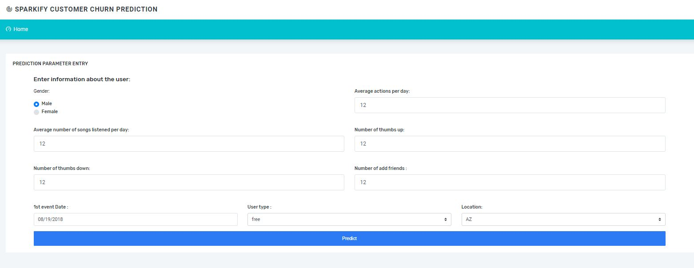

# Data Scientist Nanodegree

## Project: Disaster Response Pipeline

## Table of Contents

- [Project Overview](#overview)
- [Project Components](#components)
  - [ETL Pipeline](#etl_pipeline)
  - [ML Pipeline](#ml_pipeline)
  - [Flask Web App](#flask)
- [Running](#run)
  - [Data Cleaning](#cleaning)
  - [Training Classifier](#training)
  - [Starting the Web App](#starting)
- [Conclusion](#conclusion)
- [Files](#files)
- [Software Requirements](#sw)
- [Credits and Acknowledgements](#credits)

***

<a id='overview'></a>

## 1. Project Overview
This project uses two datasets from <a href="https://www.figure-eight.com/" target="_blank"> Figure Eight</a> for processing and classification of distress mesages from different channels. Processing is done using NLP and Machine learning techniques. Also a web application is build with the optimized classifier to classify messages to the response category of the message. This helps appropriate relief agency to increase response time for providing relief.

The web app included is to enable an emergency aid worker to input a message and get classification results in several categories. The web app also displays visualizations of the data stored in sqlite database.

[Here](#eg) are a few screenshots of the web app.

**_Screenshot 1_**
MASTER SCREEN



**_Screenshot 2_**
CLASSIFICATION SCREEN


<a id='components'></a>

## 2. Project Components

There are three components of this project:

<a id='etl_pipeline'></a>

### 2.1. ETL Pipeline

File _data/process_data.py_ contains data cleaning operations that:

- Loads the `messages` and `categories` dataset from the csv file.
- Merges the two datasets
- Cleans the data
- Stores it in a **SQLite database**

<a id='ml_pipeline'></a>

### 2.2. ML Pipeline

File _models/train_classifier.py_ contains machine learning process that:

- Loads data from the **SQLite database**
- Splits the data into training and testing sets
- Builds a text processing and machine learning pipeline
- Trains and tunes a model using GridSearchCV
- Outputs result of the test set
- Exports the final model as a pickle file

<a id='flask'></a>

### 2.3. Flask Web App
The web app shows visualization of the data stored in **SQLite Database** and also enable user to enter message in other to get quick classification categories of the message.
Running [this command](#com) **from app directory** will start the web app where users can enter their message, i.e., a request message sent during a natural disaster, e.g. _"Please, we need shelter and food in sambisa forest."_.


<a id='run'></a>
## 3. Running

There are three steps to get the appplication up and runnning with the web app.

<a id='cleaning'></a>

### 3.1. Data Cleaning

**Go to the project directory** and the run the following command:

```bat
python data/process_data.py data/disaster_messages.csv data/disaster_categories.csv data/DisasterResponse.db
```

This will perform cleaning operations on the data and save the result in sqlite database file.


<a id='training'></a>

### 3.2. Training Classifier

After the data cleaning process, run this command **from the project directory**:

```bat
python models/train_classifier.py data/DisasterResponse.db models/classifier.pkl
```

This will use the cleaned data to train the model, improve the model with grid search and saved the model to a pickle file (_classifer.pkl_).


<a id='starting'></a>

### 3.3. Starting the web app

After performing the above processes, you can now run the web app to see the visualizations.

**Go the app directory** and run the following command:

<a id='com'></a>

```bat
python run.py
```

This will start the web app and will direct you to a URL where you can enter messages and get classification results for it.
**NOTE:** Running on Windows requires you to use http://localhost:3001

<a id='eg'></a>

**_Screenshot 3_**


<a id='conclusion'></a>

## 4. Conclusion

Disasters are naturally occurring events that are usually not planned or are sometimes foreseen/predicted to occur at certain period. When this happens, it is important to know what kind of emergencies are needed by victims affected by the event. Timely categorization of news reports, texts, and calls can help the relief agencies quickly assess the situation and provide neccessary assistance. This project is tailored to help a user/aid worker to timely make decissions on message received by using the user interface to input the message in other to get the category the message belongs.

**_Screenshot 4_**


The accuracy metric for the ML training is high (this can be seen after the model is trained by grid search, it is ~0.94). 

<a id='files'></a>

## 5. Files

<pre>
.
├── app
│   ├── run.py------------------------# FLASK TO RUN THE WEB APP
│   ├── static------------------------# STATIC FILES FOR THE WEB APP
│   └── templates
│       ├── go.html-------------------# CLASSIFICATION RESULT PAGE OF WEB APP
│       └── master.html---------------# MAIN PAGE OF WEB APP
├── data
│   ├── DisasterResponse.db-----------# DATABASE TO SAVE CLEANED DATA
│   ├── disaster_categories.csv-------# DATA TO PROCESS
│   ├── disaster_messages.csv---------# DATA TO PROCESS
│   └── process_data.py---------------# PERFORMS ETL TASK
├── screenshots-----------------------# IMAGES USES IN README FROM THE WEB APP
├── models
│   └── train_classifier.py-----------# PERFORMS CLASSIFICATION TASK
│   └── classifier.pkl----------------# ML TRAINING RESULT 

</pre>

<a id='sw'></a>

## 6. Software Requirements

This project uses **Python 3.7**

<a id='credits'></a>

## 7. Credits and Acknowledgements

Thanks <a href="https://www.udacity.com" target="_blank">Udacity</a> team and <a href="https://www.figure-eight.com/" target="_blank"> Figure Eight</a> for providing the data for this project.. 
Template for web app is gotten from <a href="https://coderthemes.com" target="_blank">Coder Themes</a>.

